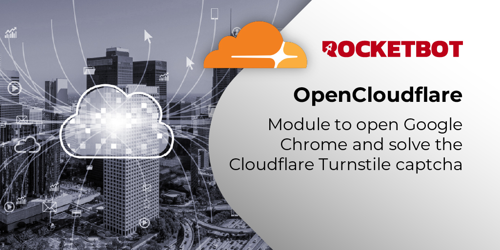

# OpenCloudflare

Module to open Google Chrome and solve the Cloudflare Turnstile captcha.

*Read this in other languages: [English](Manual_OpenCloudflare.md), [Português](Manual_OpenCloudflare.pr.md), [Español](Manual_OpenCloudflare.es.md)*

## How to install this module

To install the module in Rocketbot Studio, it can be done in two ways:
1. Manual: __Download__ the .zip file and unzip it in the modules folder. The folder name must be the same as the module and inside it must have the following files and folders: \__init__.py, package.json, docs, example and libs. If you have the application open, refresh your browser to be able to use the new module.
2. Automatic: When entering Rocketbot Studio on the right margin you will find the **Addons** section, select **Install Mods**, search for the desired module and press install.

## Description of the commands

### Open Browser

Open a Chrome browser
|Parameters|Description|example|
| --- | --- | --- |
|URL|URL to access.|https://rocketbot.com/en|
|Retries|Defines how many times the driver will attempt to reload the URL if the first load fails.|5|
|Download Folder|Path to the folder where downloads will be saved.|C:/Users/User/Downloads|
|Height|Browser window height in pixels. Will be used if an error occurs when maximizing the window.|1080|
|Width|Browser window width in pixels. Will be used if an error occurs when maximizing the window.|1920|
|Session|Session identifier|1|
|Variable||res|

### Solve Cloudflare Captcha

Solve the Cloudflare captcha that is present in the open browser.
|Parameters|Description|example|
| --- | --- | --- |
|Session|Session identifier|1|
|Variable||res|

### Close Browser

Closes a Chrome session opened by this module.
|Parameters|Description|example|
| --- | --- | --- |
|Session|Session identifier|1|
|Variable||res|
